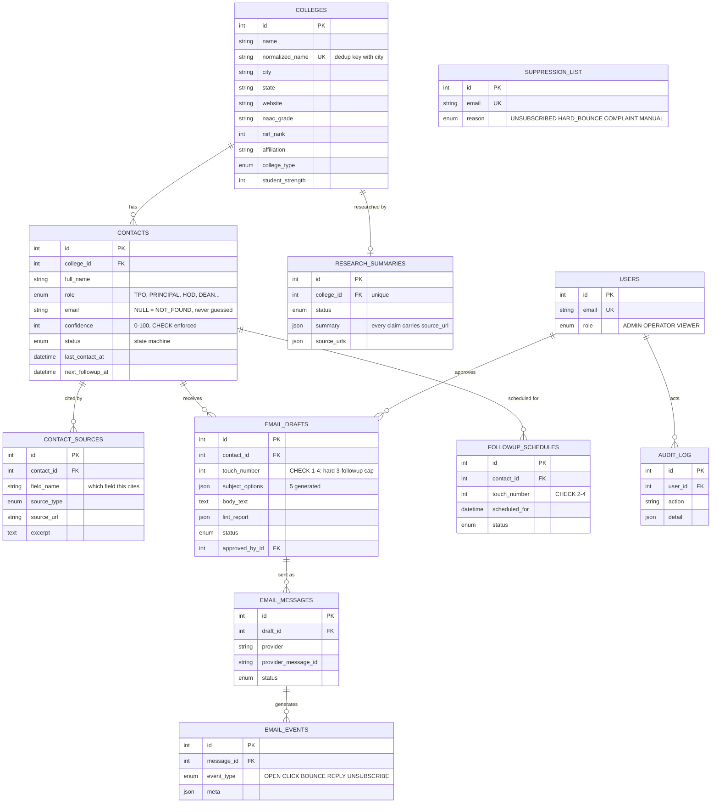

# Database Design (Phase 2)

PostgreSQL 16 in production, SQLite for unit tests (all types/constraints are portable).
Migrations: Alembic (`backend/alembic/`). Initial revision: `a3637d12c61b`.

## ERD



## Compliance encoded as constraints

| Rule | Enforcement |
|---|---|
| Max 4 emails per contact (1 initial + 3 follow-ups) | `CHECK (touch_number BETWEEN 1 AND 4)` + `UNIQUE (contact_id, touch_number)` on `email_drafts` |
| Follow-ups only touches 2–4 | `CHECK (touch_number BETWEEN 2 AND 4)` on `followup_schedules` |
| One suppression entry per address; sender checks it at send time | `UNIQUE (email)` on `suppression_list` |
| Confidence must be a real 0–100 score | `CHECK (confidence BETWEEN 0 AND 100)` |
| No duplicate colleges from fuzzy discovery | `UNIQUE (normalized_name, city)` |
| No duplicate contact per college mailbox | `UNIQUE (college_id, email)` |
| Provenance mandatory | `contact_sources.source_url` NOT NULL; research JSON stores per-claim URLs |

## Contact status machine

`DISCOVERED → VERIFIED | NEEDS_MANUAL_REVIEW → QUEUED → CONTACTED → REPLIED_POSITIVE | REPLIED_NEGATIVE | NO_REPLY_EXHAUSTED | BOUNCED | UNSUBSCRIBED`, then `REPLIED_POSITIVE → MEETING_SCHEDULED → WON | LOST`.

Transitions happen only in service-layer functions (Phase 7) that also write `audit_log`.

## Running it

```powershell
cd backend
.\.venv\Scripts\Activate.ps1
pytest                    # 6 schema/constraint tests
alembic upgrade head      # applies to DATABASE_URL (Postgres in prod)
```
